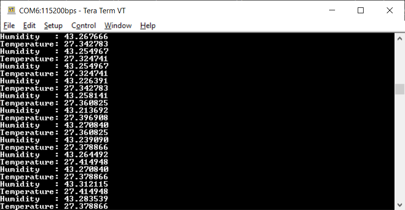

# HTS221 example for the B-L475E-IOT01A board
This example shows how to use the HTS221 sensor

## Supported Hardware
This example can run on the [B-L475E-IOT01A](https://www.st.com/content/st_com/en/products/evaluation-tools/product-evaluation-tools/mcu-mpu-eval-tools/stm32-mcu-mpu-eval-tools/stm32-discovery-kits/b-l475e-iot01a.html) and on the [B-L4S5I-IOT01A](https://www.st.com/content/st_com/en/products/evaluation-tools/product-evaluation-tools/mcu-mpu-eval-tools/stm32-mcu-mpu-eval-tools/stm32-discovery-kits/b-l4s5i-iot01a.html)

## Supported IDEs
This project was tested with IAR 8.50.6

## Required Hardware
* [B-L475E-IOT01A](https://www.st.com/content/st_com/en/products/evaluation-tools/product-evaluation-tools/mcu-mpu-eval-tools/stm32-mcu-mpu-eval-tools/stm32-discovery-kits/b-l475e-iot01a.html) or [B-L4S5I-IOT01A](https://www.st.com/content/st_com/en/products/evaluation-tools/product-evaluation-tools/mcu-mpu-eval-tools/stm32-mcu-mpu-eval-tools/stm32-discovery-kits/b-l4s5i-iot01a.html)

* USB Micro cable

## Required software
* IAR
* [STM32CubeMX](www.st.com/STM32CubeMX)
* [STMicroelectronics.X-CUBE-COMPONENTS.1.4.1.pack](https://github.com/SlimJallouli/X-CUBE-COMPONENTS/blob/main/Pack/STMicroelectronics.X-CUBE-COMPONENTS.1.4.1.pack)
* Teraterm or any other terminal software (Termite)

## How to run
1. Connect your STM32 board to your computer through the ST-Link USB
1. Open Teraterm and set it to your ST-Link COM port, 115200, 8 bits, 1 stop, no parity
1. Open IAR project
1. Build and run

## Output
