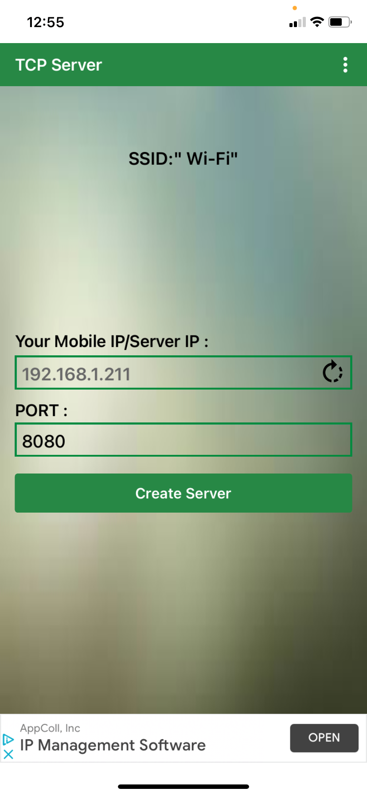
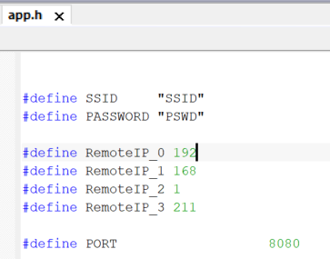
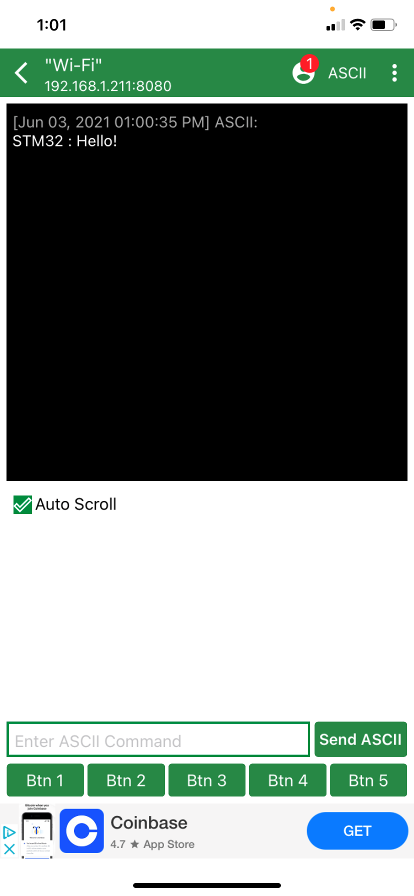
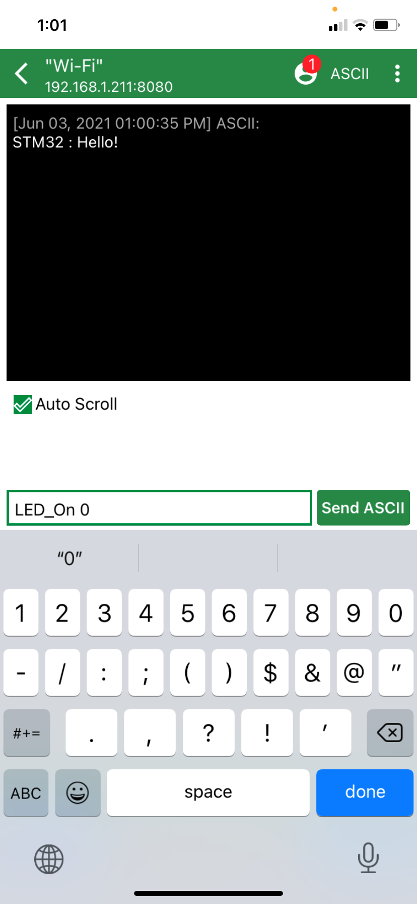
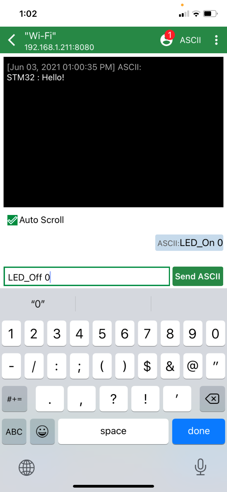
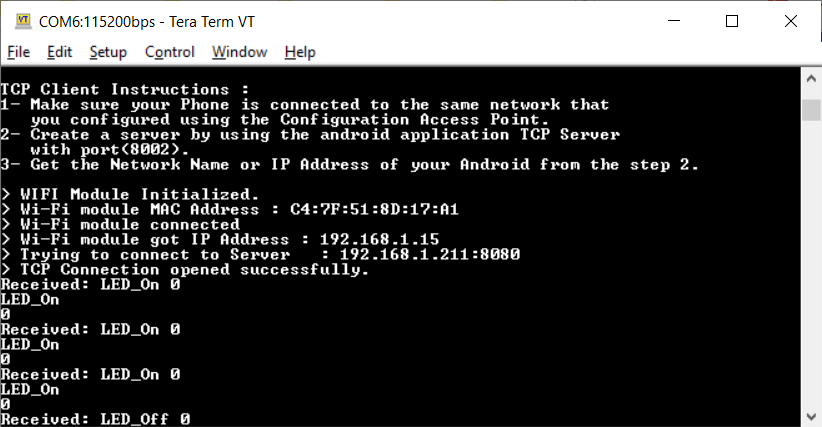

# WiFi_Client_Server
This example shows how to connect B-L475E-IOT01A to a server using Wi-Fi

## Supported Hardware
This example can run on the [B-L475E-IOT01A](https://www.st.com/content/st_com/en/products/evaluation-tools/product-evaluation-tools/mcu-mpu-eval-tools/stm32-mcu-mpu-eval-tools/stm32-discovery-kits/b-l475e-iot01a.html) and on the [B-L4S5I-IOT01A](https://www.st.com/content/st_com/en/products/evaluation-tools/product-evaluation-tools/mcu-mpu-eval-tools/stm32-mcu-mpu-eval-tools/stm32-discovery-kits/b-l4s5i-iot01a.html)

## Supported IDEs
This project was tested with IAR 8.50.6
This project can be generated for STM32CubeIDE and Keil

## Required Hardware
* [B-L475E-IOT01A](https://www.st.com/content/st_com/en/products/evaluation-tools/product-evaluation-tools/mcu-mpu-eval-tools/stm32-mcu-mpu-eval-tools/stm32-discovery-kits/b-l475e-iot01a.html) or [B-L4S5I-IOT01A](https://www.st.com/content/st_com/en/products/evaluation-tools/product-evaluation-tools/mcu-mpu-eval-tools/stm32-mcu-mpu-eval-tools/stm32-discovery-kits/b-l4s5i-iot01a.html)

* USB Micro cable

## Required software
* IAR
* [STM32CubeMX](www.st.com/STM32CubeMX)
* [STMicroelectronics.X-CUBE-COMPONENTS.1.4.1.pack](https://github.com/SlimJallouli/X-CUBE-COMPONENTS/blob/main/Pack/STMicroelectronics.X-CUBE-COMPONENTS.1.4.1.pack)
* Teraterm or any other terminal software (Termite)
* TCP Server app in [Google play](https://play.google.com/store/apps/details?id=com.mightyIT.gops.tcpserver&hl=en_US&gl=US) or [in App store](https://apps.apple.com/us/app/tcp-server/id1402550566)

## Install STMicroelectronics.X-CUBE-COMPONENTS.1.4.1.pack
1. Download [STMicroelectronics.X-CUBE-COMPONENTS.1.4.1.pack](https://github.com/SlimJallouli/X-CUBE-COMPONENTS/blob/main/Pack/STMicroelectronics.X-CUBE-COMPONENTS.1.4.1.pack)
1. Open STM32CubeMX
1. Click **INSTALL/REMOVE**
1. Click **From Local**
1. Select the **STMicroelectronics.X-CUBE-COMPONENTS.1.4.1.pack** you just downloaded
1. Click **Open**
1. Accept the license

## How to run
1. You should have your phone connected to the same Wi-Fi network that you intent to connect your board to
1. On your phone, open the **TCP Server app** and not the IP address. Set the Port to 8080 
1. Open IAR project
1. Open ***app.h*** and Update the WiFi SSID and Password, update the ***RemoteIP_0 to RemoteIP_3*** to reflect the IP address presented by the **TCP Server app**, make sure the ***PORT*** number is the same as in the **TCP Server app** 

1. Connect your STM32 board to your computer through the ST-Link USB
1. Open Teraterm and set it to your ST-Link COM port, 115200, 8 bits, 1 stop, no parity

1. Build and run
1. Click ***Create Server*** on the **TCP Server app** if you have not done it in setp 2
1. You should see your board connected 
1. On the **TCP Server app**, use the ASCII text box to send ***LED_On 0*** and  ***LED_Off 0*** to turn On/Off LED0 on the board  
1. On the board, press the **user button** (Blue) and a message is sent to the **TCP Server app**

# Known issues
Sometimes the board takes long time to connect.

# Workaround
Reset the board and Dicoennect/Connect the TCP Server app

## Output
